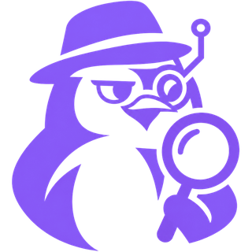
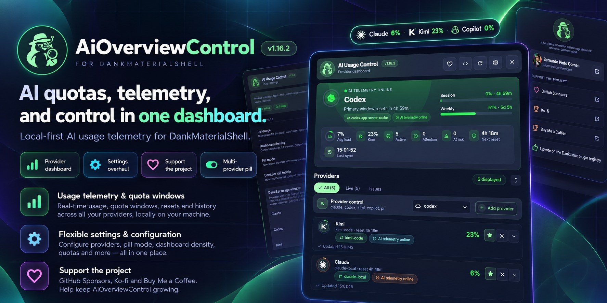
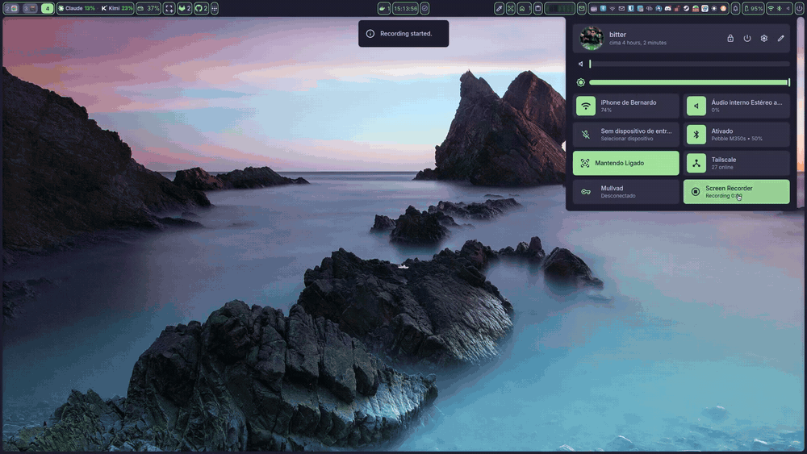
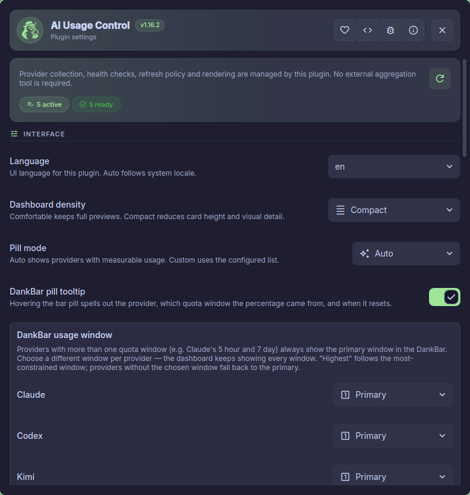
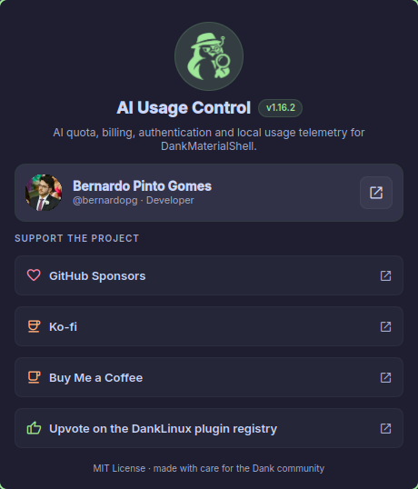

<div align="center">



# AiOverviewControl

**Every AI quota you pay for, live in your DankBar.**

A [DankMaterialShell](https://github.com/AvengeMedia/DankMaterialShell) plugin that tracks
quota, billing, authentication, and local usage for 37 AI providers — locally, honestly,
with no external service.

[](https://github.com/bernardopg/AiOverviewControl/releases/latest)
[](https://github.com/bernardopg/AiOverviewControl/actions/workflows/ci.yml)
[](./docs/providers.md)
[](./docs/i18n-crowdin.md)
[](./LICENSE)

[**Demo**](#-demo) · [**Install**](#-quick-start) · [**Screenshots**](#-a-closer-look) · [**Providers**](./docs/providers.md) · [**Docs**](#-documentation) · [**Support**](#-support-the-project) · [Português](./docs/README.pt-BR.md)

<br />



</div>

## 🎬 Demo

<div align="center">



<sub><a href="./docs/assets/demo.mp4">Full-quality MP4</a></sub>

</div>

## ✨ Why AiOverviewControl

You pay for Claude, Codex, Copilot, OpenRouter… and each one hides its quota in a
different dashboard, CLI, or API. AiOverviewControl reads every provider
**independently and on your machine**, then shows one overview.

It reports measured data when a real source exists, and says plainly when a
provider is authentication-only or informational. No dashboard scraping. No
invented percentages.

## 🚀 Features

<table>
<tr>
<td width="50%" valign="top">

**📊 One dashboard, 37 providers**<br />
Quota, balance, analytics, and auth status side by side, with a fleet overview
of average load, hottest provider, and next reset.

</td>
<td width="50%" valign="top">

**🎯 A pill that tells the truth**<br />
Pick which quota window each provider shows in the bar, or follow the
most-constrained one. Hover for the window and reset time.

</td>
</tr>
<tr>
<td valign="top">

**🤖 Deep local telemetry**<br />
Claude, 9Router, pi, and Hermes add token, cost, model, and project analytics
with a seven-day chart — read from data already on your disk.

</td>
<td valign="top">

**🔔 Quota alerts**<br />
Desktop notifications at 75, 85, or 95% — or per-provider thresholds — updated
in place instead of spamming.

</td>
</tr>
<tr>
<td valign="top">

**🛡️ Private and resilient**<br />
Secrets are never shown. One failing provider never hides the healthy ones.
No paid endpoints are called to test a key.

</td>
<td valign="top">

**🌍 Five languages**<br />
English, Português (Brasil), Español, Deutsch, and 简体中文 — including every
label the provider adapters emit.

</td>
</tr>
</table>

## 📸 A closer look

<table>
<tr>
<td align="center" width="50%"><br /><sub><b>Settings window</b> — also available in DMS Settings → Plugins</sub></td>
<td align="center" width="50%"><br /><sub><b>About</b> — version, developer, and ways to support the project</sub></td>
</tr>
</table>

## ⚡ Quick start

**1. Install** from the DMS plugin store:

```bash
dms plugins install aiOverviewControl
```

Or search for **AiOverviewControl** in DMS Settings → Plugins, or in the
[Dank Plugins directory](https://danklinux.com/plugins).

**2. Add the widget** to a DankBar section in DMS settings.

**3. Sign in** to the providers you use. The default set needs:

```bash
command -v bash jq curl codex claude gh
codex login && claude auth status && gh auth status
```

Open the ⚙ settings window to enable more providers — each one shows whether
its CLI or credential is ready.

> [!TIP]
> Bind the dashboard to a shortcut: `dms ipc call aiOverviewControl toggle`.
> See [Usage](./docs/usage.md#ipc-commands) for all commands.

Prefer a release archive or a git checkout? See [Installation](./docs/installation.md).

## 🧩 Providers

| Coverage | What you get | Examples |
| --- | --- | --- |
| **Quota** | Real usage % and reset time | Codex, Copilot, Antigravity, OpenRouter, Z.ai, GLM, xAI |
| **Balance** | Remaining prepaid credit | Kimi, DeepSeek |
| **Analytics** | Tokens, cost, and models from local data | Claude, 9Router, pi, Hermes, Cloudflare |
| **Authentication** | Credential check, no usage numbers | Gemini, Mistral, Qwen, Groq, Cohere |
| **Local runtime** | Local models and sessions | Ollama, Vertex AI |
| **Informational** | A link to the official usage page | Cursor, Kiro, Warp, Perplexity |

The full list, data sources, and credentials are in [Providers](./docs/providers.md).

## 📚 Documentation

| | |
| --- | --- |
| [Usage](./docs/usage.md) | Pill, popout, cards, keyboard, IPC, history, privacy |
| [Installation](./docs/installation.md) | Store, archive, and git installs; upgrades |
| [Configuration](./docs/configuration.md) | Every setting, environment variables, health checks |
| [Providers](./docs/providers.md) | Coverage matrix and per-provider data sources |
| [Troubleshooting](./docs/troubleshooting.md) | Missing cards, credentials, notifications |
| [Architecture](./docs/architecture.md) | Runtime flow and the adapter contract |
| [Translations](./docs/i18n-crowdin.md) | Locales and Crowdin |
| [Contributing](./CONTRIBUTING.md) | Local checks and conventions |
| [Changelog](./CHANGELOG.md) | Release history |

## 💜 Support the project

The [Dank Plugins directory](https://danklinux.com/plugins) ranks plugins by the 👍
reactions on their registry issue. One reaction is the most useful thing you can
do — it decides whether other DankMaterialShell users ever find the plugin.

<div align="center">

[](https://github.com/AvengeMedia/dms-plugin-registry/issues/358)
[](https://github.com/bernardopg/AiOverviewControl/stargazers)

[](https://github.com/sponsors/bernardopg)
[](https://ko-fi.com/bernardopg)
[](https://buymeacoffee.com/wctwom9emu)

</div>

Found a bug or have an idea? [Open an issue](https://github.com/bernardopg/AiOverviewControl/issues/new/choose).

## 👥 Contributors

<div align="center">

<!-- CONTRIBUTORS:START - generated by scripts/render-contributors -->

<a href="https://github.com/bernardopg" title="bernardopg"></a>
<a href="https://github.com/dangrover" title="dangrover"></a>
<a href="https://github.com/gtheys" title="gtheys"></a>
<a href="https://github.com/Luna161" title="Luna161"></a>
<a href="https://github.com/arqueon" title="arqueon"></a>
<a href="https://github.com/goulartdev" title="goulartdev"></a>
<a href="https://github.com/emmsixx" title="emmsixx"></a>
<a href="https://github.com/Murat65536" title="Murat65536"></a>
<a href="https://github.com/gouwazi" title="gouwazi"></a>
<a href="https://github.com/UN-9BOT" title="UN-9BOT"></a>

<!-- CONTRIBUTORS:END -->

Contributions are welcome — start with [CONTRIBUTING.md](./CONTRIBUTING.md).

</div>

---

<div align="center">
<sub>MIT License · made with 💜 for the <a href="https://github.com/AvengeMedia/DankMaterialShell">DankMaterialShell</a> community</sub>
</div>
